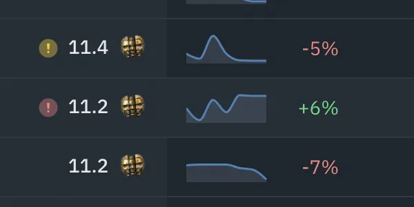

# POE-Economy



# Foreword

In this blog, you will travel with me on my quest to conquer the stock market named `**Path Of Exile` -** its economy to be exact. This project is a market analysis that aims to 

- Introduce you to POE game and its fascinating aspect: the in-game economy
- This project aims to study the trends of the economy of some items and currency being traded
- To help better understanding of the in-game economy and the real world economy alike
- Also, I aim to be able to study from the past economy fluctuations and apply it to make prediction at current time
- Helping to aid the player with information that would help them make better decisions during their short time playing the game and not get lost in the enormous economy.

You can reference the project’s [source code](https://github.com/produdez/poe-economy) or download my [pptx presentation](https://github.com/produdez/poe-economy/blob/main/presentation/POE%20Economy.pptx) for more details

---

**Final achievements of the project includes:**

1. Develop a model to predict 5 days in the future of a currency item's market value
2. Experiment and choose one model that performs
3. Expand and apply model on many different market objects
4. Compare some models, discussion and report findings

> *For more detail on any sections below, just visit the link to my notebook* 😇
> 

# POE Economy

[Notebook](https://github.com/produdez/poe-economy/blob/main/Introduction.ipynb)

### **POE?**

Simply put : `Online` / `RPG` / `MMO` 


### The Market Place

The game would not be finished without mentioning its market place. **Though sound simple, the economy is more than half of the game itself.**

- Firstly, player find item, trade for other items and make profit along the way, accumulating more wealth and allowing them to build better and stronger character for the adventure
- Secondly, as every other real world market, there are all the interactions inside the market:
    - Selling looted stuff for profit
    - Flipping item (buy low sell high)
    - Selling item in bulk at higher price
    - Scam people (of course this happens)
    - First seller sets the price
    - Price is also driven demand and supply
    - And even things that are not items can also be traded, the market is always teeming with life

That's what make playing the game so much more interesting for many

### Medium of Exchange


> Interestingly, in POE, there is no such thing is `MONEY`, the developer never specifically implement real world cash or coins to regulate the system, but instead, just as any free trading market, trading innovation needs the invention of some Medium Of Exchange.
> 

And in this case, the player base of POE chose the **Chaos Orb** as their in game `Money` , why?

- It's a relatively easy to obtain item
- The amount of `chaos orb` in the economy increases overtime very fast as the play time goes on and player acquire more of it
- It does not inflate too quick because it is not something that can be mass produce too fast. This is also the reason that other more common items are not used as the medium of exchange (I think)

# Motivation

[Notebook](https://github.com/produdez/poe-economy/blob/main/Motivation.ipynb)

### The "LEAGUE" Mechanic

`A league`: is usually a time period of gameplay of 3 months where the developer would usually introduce some new gameplay mechanic to make the game new and appealing to new players.

As of currently (31-12-2021), the game has gone through almost `35` leagues already.


`At the start of each league, the previous economy is also reset and everyone will start the new league at the same place (with zero asset) and have to start making money by adventuring in the game itself.`

This is why the in game economy usually follows a repeated trend:

- Items are high price at the start when they're still rare and less available
- The price drop slowly at the end of the league where stuff are more available
- People also tend to reduce item prices at the end of league since they will be reset anyways

Because of the usual trend, players are encouraged to jump into playing the game at the early stages of a league start. It always have a fresh and fair feeling where the whole player base starts equal and work their way up. Also:

- The idea that `the early bird gets the worm` is very enticing, who ever gets the item first is guarantee to be able to set a higher price for the item
- People that gets lucky with high value item drop early can easily build a fortune quickly
- Item scarcity also means `low value` items will have a decent price at the start when the market is not saturated

Here is a graph `Mirror Of Kalandra`, one of the rarest items of the game. The graph has:

- Plot of price over some leagues
- Price is in `Chaos Orb` currency
- Time is 120 days (3 months)


### Goal

> `What if we can learn from this historical data and apply it to use in future leagues' prediction?`
> 

```
- This is a study on economics, at least a more restricted, experimental version of the economy.
- This deals with time-series data, which is very typical in price and stock market
- This has a practical application in the game itself as a price prediction tool in the future
```

# Data Acquisition

[Notebook](https://github.com/produdez/poe-economy/blob/main/DataAcquisition.ipynb)


[Poe Ninja](https://poe.ninja/) *(a market dashboard site)* keeps a data dump of many POE leagues in form of CSV files, and this will be the data source for our project

- The data include all leagues from `Essence` league to the current league `Scourge` (excluding the current league).
- 18 Most recent leagues to be precise (compare to the total 35 leagues)

**Example data**

```
League; Date;       Get;            Pay;        Value;      Confidence
Abyss;  2017-12-09; Exalted Orb;    Chaos Orb;  26.16644;   High
Abyss;  2017-12-10; Exalted Orb;    Chaos Orb;  35.92556;   High
```

# Data Exploration

[Notebook](https://github.com/produdez/poe-economy/blob/main/DataExploration.ipynb)

> I highly recommend you visit the notebook to see more detail about how the data is organized into files, its scale/format, etc. Lots of visuals are also included ***(Seasonal, Trend, Autocorrelation, Partial Autocorrelation, Decomposition)***
> 

I’ve taken my own liberty and divide the items in the game into 4 price brackets, and choose an item to represent each bracket:

1. Very low values (<0.5) - `Orb of Alteration`
2. Low value (~2) - `Offering to the Goddess`
3. Medium value (~10 - 20) - `Divine Orb`
4. High value (>70) - `Exalted Orb`

Here are some visuals of items over many different leagues

- `Orb of Alteration` over leagues
    
    
    
- `Offering to the Goddess` over leagues
    
    
    
- `Divine Orb` over leagues
    
    
    
- `Exalted Orb` over leagues
    
    
    

# Idea

> **I’ll train my model on the data of `Exalted Orb` and expand the best model to use for prediction on other market objects**
> 

# Preprocessing

[Notebook](https://github.com/produdez/poe-economy/blob/main/Sampling-Preprocessing.ipynb)

Since the data is spread out into multiple files, I’ve collect them into a single data frame to easily use it in later steps. The preprocessing steps include:

1. Sampling / Extracting: Iterate the files and combine their `Exalted Orb`'s data into one
2. Processing: Label encoding, Nan checking, Unique value checking
3. Then save the whole processed data into a `.csv` file for later steps

# Feature Engineering

[Notebook](https://github.com/produdez/poe-economy/blob/main/FeatureEngineering.ipynb)

Here I expand the previous data frame with some time-series features that could be used in model training such as:

- Date feature: date of weak, league day, month
- Lag feature
- Rolling features: rolling mean/max/min
- Expanding features: mean/max/min

*Afterwards train test split is performed, ready for training*

# Modelling

[Notebook](https://github.com/produdez/poe-economy/tree/main/experiments)

### Experiments

The final model that I’ve selected is `Regressor Chain with Random Forest Estimator`. Of course I must have had my experiments before coming to the eventual selection. All my other models that were experimented on can be found [Here](https://github.com/produdez/poe-economy/tree/main/experiments). Those include:

- `Regressor Chain` with base estimator one of these below:
    - `Linear Regressor`
    - `XGB Regressor`
    - `Random Forest`
    - `Lasso`
- Neural Network:
    - Simple NN: 64 → 64 → 5
    - NN with more nodes: 200 → 100 → 5
- Recursive Network:
    - Vanilla `RNN`: 200 RNN nodes → 100 Dense NN → 5 Dense NN (`ReLU` activation)
    - Vanilla `RSTM`: Similar setup as above RNN
    - `Encoder - Decoder` LSTM
    - `Stacked LSTM`
- Trashed Models due to performance/simplicity *(ignore these)*
    - `Linear Regression` and a variation with added lags
    - `Boosted Hybrid` of `Linear Regression` and `XGB Regressor`
    - `AutoARIMA`
    - `Persistence Model`

> Final result comparing major models is below
> 


### Regressor Chain with Random Forest Estimator

Looking at the best model

- Here’s the ‘fit’
    
    
    
- And its feature importance
    
    
    

Feature importance here includes

- Rolling Mean
- And Previous prediction from previous regressor in chain
- Minor features: rolling min, max, league day
- Most other features are 0

# Expansion

[Notebook](https://github.com/produdez/poe-economy/blob/main/ExpandedModeling.ipynb)

> Moving on to bench-marking our best model against other market objects. Look at the notebook for more detailed step-by-step procedure
> 

Summary results is in table below


*****************Can be seen that result is acceptable but also is not very impressive, varies by market object*****************

# Conclusion

[Notebook](https://github.com/produdez/poe-economy/blob/main/Comparison-Conclusion.ipynb) (also includes models performance comparison)

### Notable points

1. Between different model groups

- RNN, LSTM and NN generally gives terrible result, and is completely random for each run with high result variance
- Mean while the simple Regressor Chain + Basic ML Model does perform quite well
1. The worst performing parts of the prediction is the start and end of each league, due to
    - Models unable to learn the point where the economy restarts
    - Could be overfit or data is too difficult to learn
2. Can seen that the plotted prediction is not very good
    - The best model (Random Forest) only get as much as 0.13 MAPE in validation

### Achievement

- Try out various types of model for multi-step prediction (5 steps)
- Comparison between models
- `Acceptable Result` (best at 0.13 MAPE - Exalted Orb)

### Downsides

- Model result varies for each different training object
    - Best being ~0.08-0.09 MAPE
    - Worst being ~0.36 MAPE (`Blessing of Chayula`)
    - Lower tier object seems to fluctuate less leading to better fit compared to higher tiers
- The used data is very random with no trend, no seasonality and probably no cycles also
- There are probably some other problems that might not be realized and fix:
    1. Overfitting
    2. More Preprocessing?
    3. Better feature engineering
    4. Overall lack of experience and techniques

### Possible improvements

> *(Possible Future work)*
> 
- Test with live data, making use of the economy's market API
- Development into a functional tool? (comes with many problems of course)
- More research overall
