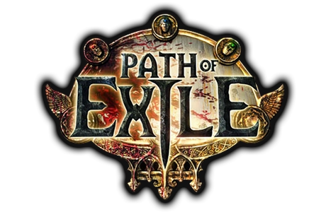
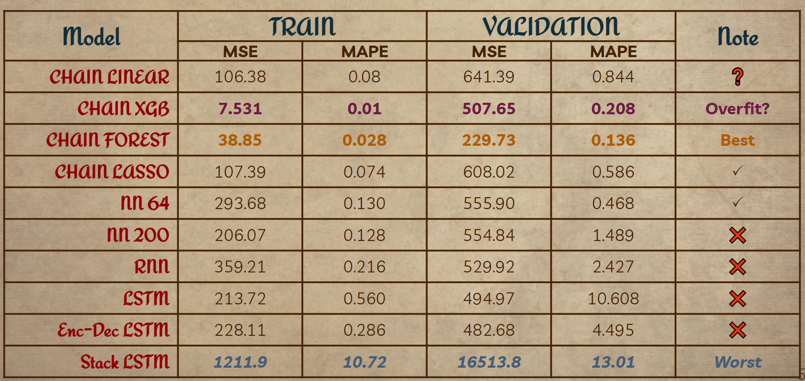
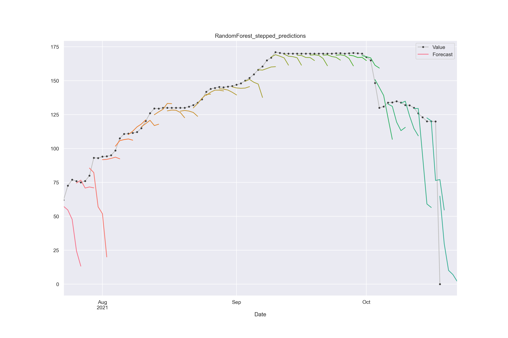
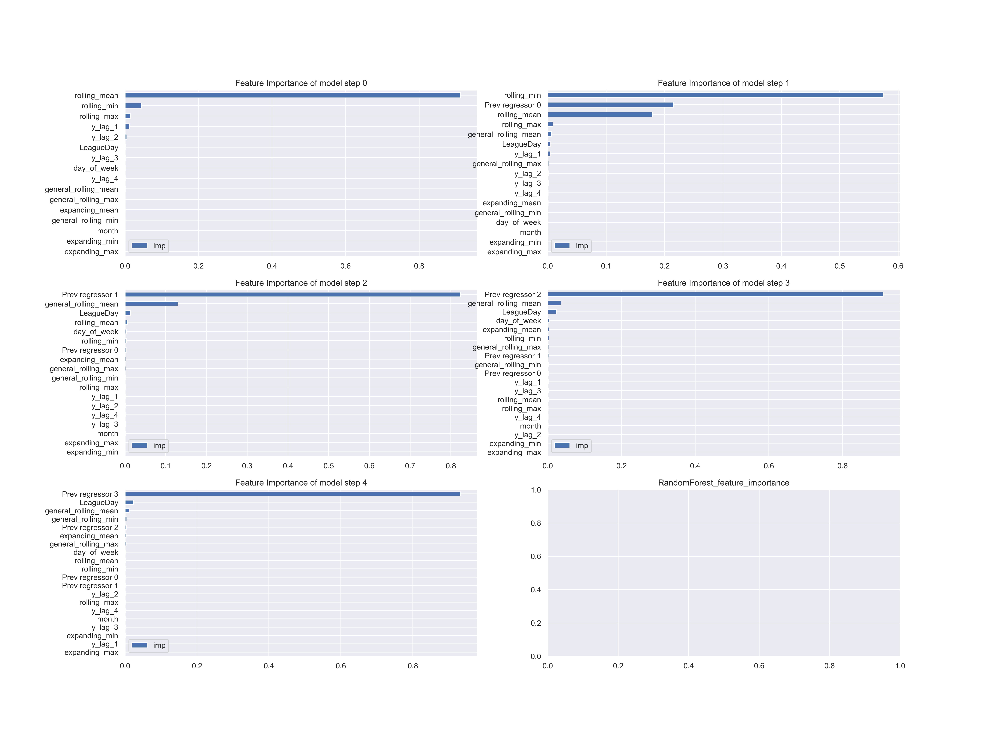
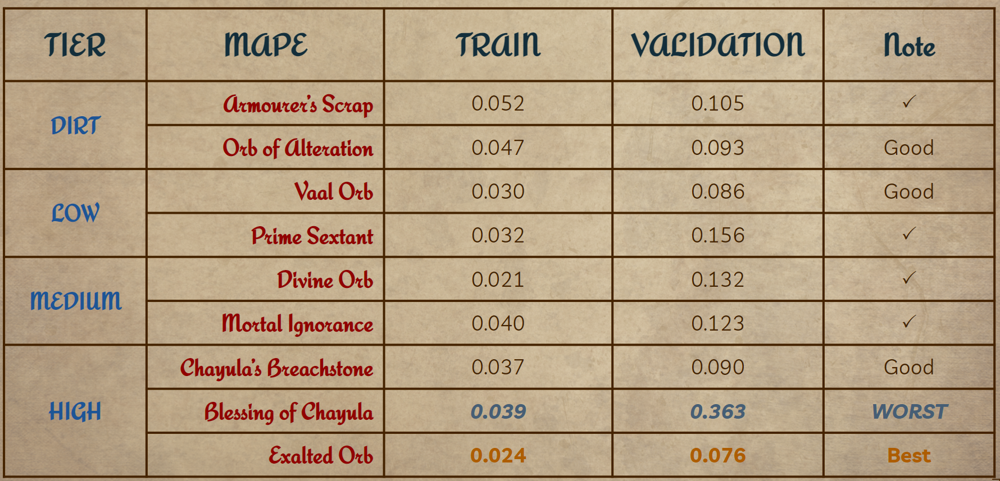

<!-- icons  -->
[1.1]: https://img.shields.io/badge/GitHub-100000?style=for-the-badge&logo=github&logoColor=white
[2.1]: https://img.shields.io/badge/LinkedIn-0077B5?style=for-the-badge&logo=linkedin&logoColor=white
[3.1]: https://img.shields.io/badge/Medium-12100E?style=for-the-badge&logo=medium&logoColor=white
[4.1]: https://img.shields.io/badge/Twitter-1DA1F2?style=for-the-badge&logo=twitter&logoColor=white

<!-- links to your social media accounts -->
[1]: https://github.com/produdez
[2]: https://www.linkedin.com/in/produdez/
[3]: https://medium.com/@produde
[4]: https://twitter.com/_Produde_

# POE Economy

    

**Description:**

A Path of Exile Market Analysis Project.

Aims:

- Develop a model to predict 5 days in the future of a currency item's market value
- Experiment and choose one model that performs
- Expand and apply model on many different market objects
- Compare some models, discussion and report findings

Final presentation can be found [here](https://github.com/produdez/poe-economy/blob/main/presentation/POE%20Economy.pptx) or [here](https://docs.google.com/presentation/d/18gEAowiZqOa4HgHe7_SMQTDrLMVnJT4KGzyIaPt-5A8/edit?usp=sharing)

## General Information

In this project, i will:

- Introduce you to POE game
- And its fascinating aspect: the in-game economy
- This project aims to study the trends of the economy of some items and currency being traded
- To help better understanding of the in-game economy and the real world economy alike
- Also, I aim to be able to study from the past economy fluctuations and apply it to make prediction at current time
- Helping to aid the player with information that would help them make better decisions during their short time playing and not get lost in the enormous economy.

## Main Parts

Each in its own notebook file:

1. POE Introduction: POE and the economy
2. Project motivation and reasons for conducting research
3. Data Acquisition
4. Data Exploration
5. Machine learning approach on market historical data (time-series)
6. Prediction using real-time data through POE API
7. Results and Conclusions

## Screenshots

1. Model result comparison

       

2. Exalted Orb Trend between different leagues

    

3. Regressor Chain with Random Forest estimator model stepped prediction result (best model)

    

4. Feature importance for best model

    

5. Best model's performance on other objects

    
## Future Improvements

- Better models
- Expand to predict using real-time data through POE API

## Acknowledgements

- This project is the final assignment for the `DiveIntoCode` Machine Learning course
- This project was inspired by [Path Of Exile](https://www.pathofexile.com/)
- Many thanks to [poe.ninja](https://poe.ninja/) for their dataset
- Special thanks to the mentors for reviewing my work.

## Contact

Created by [@produdez](https://github.com/produdez) - feel free to contact me or follow my blog on medium ❤️!

<!-- [![alt text][1.1]][1] -->
[![alt text][2.1]][2]
[![alt text][3.1]][3]
[![alt text][4.1]][4]
